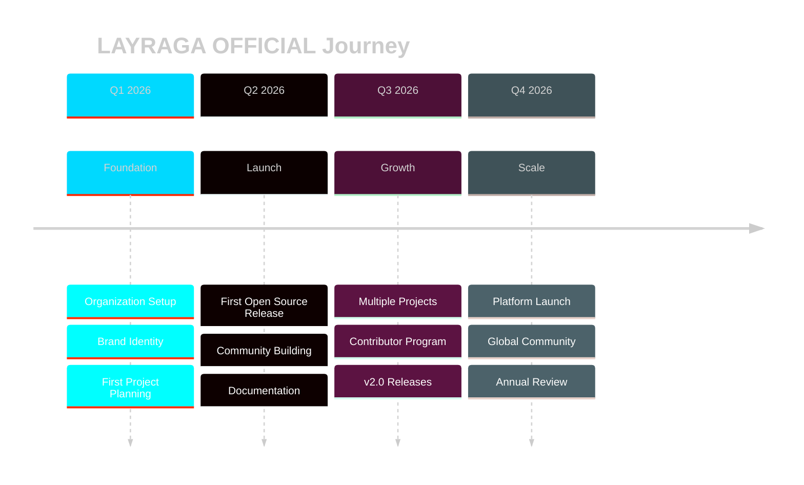

<!-- ═══════════════════════════════════════════════════════════════ -->
<!--                    LAYRAGA OFFICIAL PROFILE                     -->
<!-- ═══════════════════════════════════════════════════════════════ -->

  

 

  
  
  

  
  
  
  

  

<!-- ═══════════════════════════════════════════════════════════════ -->
<!--                        ABOUT SECTION                            -->
<!-- ═══════════════════════════════════════════════════════════════ -->

##  About Us

<table align="center" border="0">
<tr>
<td width="50%" valign="top">

### 🚀 Who We Are

**LAYRAGA OFFICIAL** is an independent software studio focused on building **modern, useful, and open-source applications**.

We believe great software should be:

| | |
|---|---|
| 🆓 **Free & Open** | Accessible to everyone |
| 🎨 **Beautiful** | Great UX matters |
| ⚡ **Fast** | Performance first |
| 🔒 **Secure** | Privacy by design |
| 🌍 **Global** | Built for the world |

</td>
<td width="50%" valign="top">

### 💬 Our Motto

 

  

</td>
</tr>
</table>

<!-- ═══════════════════════════════════════════════════════════════ -->
<!--                      PROJECTS SECTION                            -->
<!-- ═══════════════════════════════════════════════════════════════ -->

##  What We're Building

<table align="center" width="100%">
<tr>
<td width="50%" align="center">

### 🚧 Coming Soon

 

  

</td>
<td width="50%" align="center">

### 🚧 Coming Soon

 

  

</td>
</tr>
</table>

 

> 📌 **Stay tuned!** We'll announce our projects here soon.
> ⭐ **Star & watch** this organization to get notified.

 

<!-- ═══════════════════════════════════════════════════════════════ -->
<!--                        MISSION SECTION                          -->
<!-- ═══════════════════════════════════════════════════════════════ -->

##  Our Mission

**To build high-quality, open-source applications that solve real problems and make technology more accessible for everyone.**

<table align="center" width="100%">
<tr>
<td width="25%" align="center">
  
   
  <b>💡 Innovation</b>
   
  Solving problems in new ways
</td>
<td width="25%" align="center">
  
   
  <b>🌐 Community</b>
   
  Building in public, together
</td>
<td width="25%" align="center">
  
   
  <b>🎓 Learning</b>
   
  Sharing knowledge through code
</td>
<td width="25%" align="center">
  
   
  <b>❤️ Craftsmanship</b>
   
  Doing things right, not just fast
</td>
</tr>
</table>

<!-- ═══════════════════════════════════════════════════════════════ -->
<!--                        VALUES SECTION                           -->
<!-- ═══════════════════════════════════════════════════════════════ -->

##  Our Core Values

<table align="center" width="100%">
<tr>
<td align="center" width="33%">

### 🔓 Open Source First

  

Code should be free and accessible to everyone, everywhere.

</td>
<td align="center" width="33%">

### 🎨 Design Matters

  

Beautiful tools are better tools. UX is not optional.

</td>
<td align="center" width="33%">

### 🔐 Privacy First

  

User data belongs to users. Period.

</td>
</tr>
<tr>
<td align="center" width="33%">

### 🚀 Ship Fast

  

Iterate, learn, improve. Perfection is the enemy of progress.

</td>
<td align="center" width="33%">

### 🤝 Build in Public

  

Share the journey, not just the result. Transparency wins.

</td>
<td align="center" width="33%">

### ⚡ Performance

  

Every millisecond counts. Speed is a feature.

</td>
</tr>
</table>

<!-- ═══════════════════════════════════════════════════════════════ -->
<!--                       TECH STACK SECTION                        -->
<!-- ═══════════════════════════════════════════════════════════════ -->

##  Tech Stack

 

### 🎨 Frontend

  

### ⚙️ Backend

  

### 🗄️ Database & Cloud

  

### 🛠️ Tools

  

<!-- ═══════════════════════════════════════════════════════════════ -->
<!--                       GITHUB STATS SECTION                      -->
<!-- ═══════════════════════════════════════════════════════════════ -->

##  GitHub Analytics

 

  

  

  

<!-- ═══════════════════════════════════════════════════════════════ -->
<!--                       ROADMAP SECTION                           -->
<!-- ═══════════════════════════════════════════════════════════════ -->

##  Roadmap 2026

<!-- ═══════════════════════════════════════════════════════════════ -->
<!--                     COLLABORATION SECTION                       -->
<!-- ═══════════════════════════════════════════════════════════════ -->

##  Want to Collaborate?

 

<table>
<tr>
<td align="center" width="25%">
  
   
  <b>💡 Ideas & Feedback</b>
   
  What should we build next?
</td>
<td align="center" width="25%">
  
   
  <b>🐛 Bug Reports</b>
   
  Help us improve
</td>
<td align="center" width="25%">
  
   
  <b>🤝 Collaboration</b>
   
  Work with us
</td>
<td align="center" width="25%">
  
   
  <b>⭐ Support</b>
   
  Star & share
</td>
</tr>
</table>

 

<!-- ═══════════════════════════════════════════════════════════════ -->
<!--                       CONTACT SECTION                           -->
<!-- ═══════════════════════════════════════════════════════════════ -->

##  Get in Touch

 

  

  

  

  

<!-- ═══════════════════════════════════════════════════════════════ -->
<!--                        FOOTER SECTION                           -->
<!-- ═══════════════════════════════════════════════════════════════ -->

 

 

### *Building apps that matter.*

 

  

<picture>
  <source media="(prefers-color-scheme: dark)" srcset="https://raw.githubusercontent.com/layraga-official/layraga-official/output/github-contribution-grid-snake-dark.svg" />
  <source media="(prefers-color-scheme: light)" srcset="https://raw.githubusercontent.com/layraga-official/layraga-official/output/github-contribution-grid-snake.svg" />
  
</picture>

  

<!-- ═══════════════════════════════════════════════════════════════ -->
<!--                          END OF FILE                            -->
<!-- ═══════════════════════════════════════════════════════════════ -->
